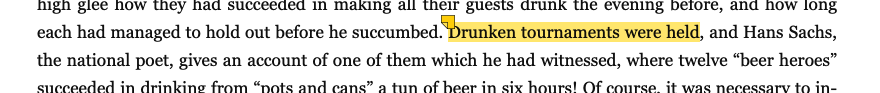

# The Problem

EPUB annotations are stored externally, not in the file itself. Each system manages annotations differently, making transfers between systems nearly impossible. BOOX NeoReader annotations can only be exported as .txt files, which other EPUB readers like Zoteros can't directly read.

# The Solution

This repository helps importing annotations from a BOOX e-readers into Zotero's EPUB reader with accurate positioning.

## Features

- Batch-Imports BOOX highlights directly into Zotero's database
- Generates accurate EPUB CFIs (Canonical Fragment Identifier) matching Zotero's format exactly
- Supports highlights with comments
- Prevents the import of duplicate annotations for easy updates
- Automatic database backup before import

## Requirements

- **Python 3.12+**
- **Node.js 20+**
- **Boox annotation export file** (from your Boox e-reader)
- **Zotero** with EPUB files in your library

## Installation

1. **Clone this repository:**
   ```bash
   git clone https://github.com/visserle/boox-annotations-to-zotero.git
   cd boox-annotations-to-zotero
   ```

2. **Install JavaScript dependencies:**
   ```bash
   npm install
   ```

## Usage

1. **Export annotations from your Boox device**. From the NeoReader app, select Contents > Annotations > Select All > Export to Local Storage or Share. The file should be named like `Book Title-annotation-YYYY-MM-DD_HH_MM_SS.txt`. Save the file to your computer.

2. **Close Zotero.**

3. **Run the import:**
   ```bash
   python -m main path/to/annotations.txt
   ```
   Zotero's path and database is automatically detected, but can be overridden with: `--zotero-dir /path/to/zotero`.

4. **Restart Zotero** to see your imported annotations.

## How It Works

1. **Parses** the Boox annotation file
2. **Finds** the matching EPUB in Zotero's database
3. **Generates** EPUB CFIs using JavaScript (ensures compatibility with Zotero)
4. **Imports** annotations directly into Zotero's SQLite database
5. **Creates** a backup before making changes

The tool uses JavaScript for CFI generation because it uses the same `epubcfi.js` code that Zotero uses, ensuring perfect compatibility.

## Troubleshooting

Make sure sure that the EPUB file is available in Zotero and that the first line of the Boox annotation .txt states the author and title in the << >> brackets (see `/examples`).

If the text is not found in EPUB, there will be a fallback CFI based on page number. The annotation will still be imported but may not be positioned exactly.

## Limitations

- Boox does not store color information in the annotation file so there is only one highlight color available.


## Running Tests

```bash
# Test CFI generation against Zotero annotations
python test/test_cfi.py
```

The test suite compares generated CFIs against actual Zotero annotations from Romeo & Juliet and The History of Drink. Tested with Python 3.13.9, Node.js 25.2.1, Zotero 7.0.30 on an M2 MacBook Air and NeoReader 38133 on a Boox Page.

## Alternative Solutions

Convert your EPUB to PDF and annotate the PDF.
